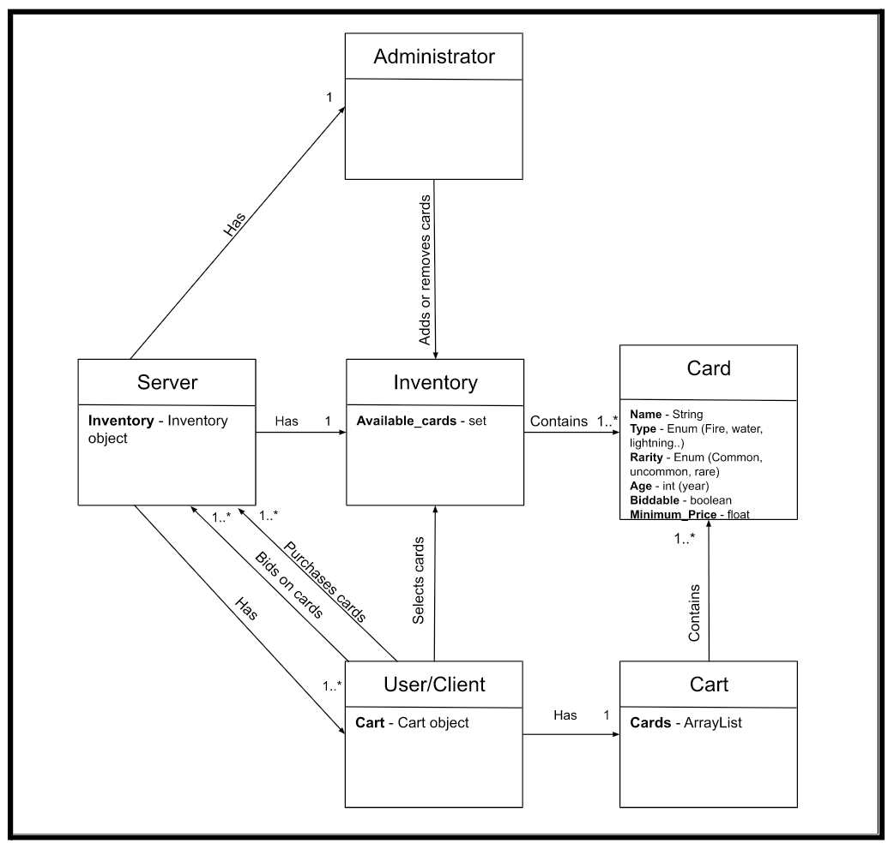

# Pokemon Card Shop Design Documentation

## Team Information
* Team name: Team 7
* Team members
  * Thomas Schollenberger
  * Jack Lindsey-noble
  * Yefim Kalytyuk
  * Bill Li

## Executive Summary
The goal of this project is to create a Pokemon Card E-Store. This E-Store will have the additional feature of having the user being able to create their own card.
## Requirements

### Definition of MVP
Minimal Authentication
- A user (customer or e-store owner) can log in or out to the application.
- An e-store owner logs in using the reserved username admin.
- Any other username can be assumed to be a customer.
Customer Functionality
- A customer should be able to search for a product.
- A customer should be able to add or remove a product from their shopping cart.
E-Store Owner Functionality
- An e-store owner can add, remove, and edit the product data in the inventory.
- An e-store owner should not have access to a shopping cart.

### MVP Features
Epics
- Shopping Cart
- Buyer Functionality
- Unique Identification
- Administrator Functionality

### Roadmap of Enhancements
- Add the 10% feature
- Make the CSS stylesheets look good
- Review the location of each feature to make sure the UX is good

## Application Domain

## Architecture and Design
### Summary

The following Tiers/Layers model shows a high-level view of the webapp's architecture.

The e-store web application, is built using the Model–View–ViewModel (MVVM) architecture pattern. 

The Model stores the application data objects including any functionality to provide persistance. 

The View is the client-side SPA built with Angular utilizing HTML, CSS and TypeScript. The ViewModel provides RESTful APIs to the client (View) as well as any logic required to manipulate the data objects from the Model.

Both the ViewModel and Model are built using Java and Spring Framework. Details of the components within these tiers are supplied below.

### Overview of User Interface

This section describes the web interface flow; this is how the user views and interacts
with the e-store application.

> _Provide a summary of the application's user interface.  Describe, from
> the user's perspective, the flow of the pages in the web application._

### View Tier
> _Provide a summary of the View Tier UI of your architecture.
> Describe the types of components in the tier and describe their
> responsibilities.  This should be a narrative description, i.e. it has
> a flow or "story line" that the reader can follow._

> _You must also provide sequence diagrams as is relevant to a particular aspects 
> of the design that you are describing.  For example, in e-store you might create a 
> sequence diagram of a customer searching for an item and adding to their cart. 
> Be sure to include an relevant HTTP reuqests from the client-side to the server-side 
> to help illustrate the end-to-end flow._

### ViewModel Tier
> _Provide a summary of this tier of your architecture. This
> section will follow the same instructions that are given for the View
> Tier above._

> _At appropriate places as part of this narrative provide one or more
> static models (UML class diagrams) with some details such as critical attributes and methods._

### Model Tier
> _Provide a summary of this tier of your architecture. This
> section will follow the same instructions that are given for the View
> Tier above._

> _At appropriate places as part of this narrative provide one or more
> static models (UML class diagrams) with some details such as critical attributes and methods._

### Static Code Analysis/Design Improvements
> _Discuss design improvements that you would make if the project were
> to continue. These improvement should be based on your direct
> analysis of where there are problems in the code base which could be
> addressed with design changes, and describe those suggested design
> improvements._

> _With the results from the Static Code Analysis exercise, 
> discuss the resulting issues/metrics measurements along with your analysis
> and recommendations for further improvements. Where relevant, include 
> screenshots from the tool and/or corresponding source code that was flagged._

## Testing
> _This section will provide information about the testing performed
> and the results of the testing._

### Acceptance Testing
> _Report on the number of user stories that have passed all their
> acceptance criteria tests, the number that have some acceptance
> criteria tests failing, and the number of user stories that
> have not had any testing yet. Highlight the issues found during
> acceptance testing and if there are any concerns._

### Unit Testing and Code Coverage
> _Discuss your unit testing strategy. Report on the code coverage
> achieved from unit testing of the code base. Discuss the team's
> coverage targets, why you selected those values, and how well your
> code coverage met your targets. If there are any anomalies, discuss
> those._
